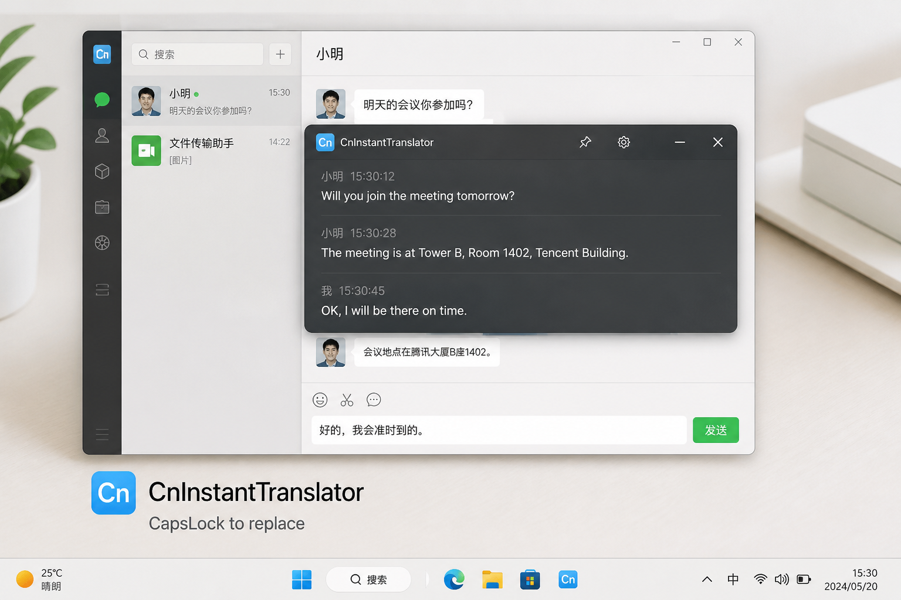

# 中文即时翻译悬浮窗（CnInstantTranslator）

> 为了你变成狼人摸羊

**一句话：** 在 QQ / 微信 / 浏览器里输入中文，停手约 1 秒后自动译成英文并显示在可拖动悬浮窗；按 **CapsLock** 一键把英文覆盖回输入框。



> 上图为界面示意。实际效果以你电脑上的悬浮窗为准。

## 适用场景

| 应用 | 支持情况 |
| --- | --- |
| **微信** | 支持（Qt 盲区适配 + 安全剪贴板兜底） |
| **QQ** | 支持（UIA 稳定路径） |
| **Edge / Chrome 等浏览器** | 支持（地址栏、网页输入框） |
| 记事本等常见输入框 | 支持 |
| ChatGPT / Codex 等 | 默认排除，不打扰 |

## 快速开始（推荐：下载 exe）

1. 打开 [Releases](https://github.com/Hrb-12138/H.rb/releases)
2. 下载最新的 `CnInstantTranslator-win-x64.zip`
3. 解压后双击 `CnInstantTranslator.exe`
4. 打开微信或 QQ，在输入框输入/粘贴中文，停约 1 秒看悬浮窗英文
5. 需要替换时按 **CapsLock**

> 自包含发布包，**一般不需要**先安装 .NET。Windows 10/11 x64。首次运行若被 Defender 拦截，选“仍要运行”即可（未做代码签名属正常现象）。

## 从源码运行

需要 [.NET 8 SDK](https://dotnet.microsoft.com/download/dotnet/8.0)：

```powershell
dotnet run --project CnInstantTranslator/CnInstantTranslator.csproj
```

或：

```powershell
dotnet build CnInstantTranslator/CnInstantTranslator.csproj -c Release
.\CnInstantTranslator\bin\Release\net8.0-windows\CnInstantTranslator.exe
```

## 常用操作

- **停手约 1 秒** 或空格/句号/回车 → 触发翻译  
- **CapsLock** → 英文回填到当前输入框  
- **托盘图标** → 暂停 / 恢复 / 退出  
- **拖动悬浮窗边缘** → 调整大小（会记住）

## 配置

首次运行后生成：

```text
%APPDATA%\CnInstantTranslator\settings.json
```

常用字段：

```json
{
  "Enabled": true,
  "Paused": false,
  "IdleDelayMs": 1000,
  "TargetLanguage": "en",
  "EngineOrder": ["sogou", "google", "bing", "deepl"],
  "OfflineMode": false,
  "ExcludedProcesses": ["chatgpt", "codex", "gw"]
}
```

Bing / DeepL 可选（需自备 Key）：

```powershell
$env:BING_TRANSLATOR_KEY = "..."
$env:BING_TRANSLATOR_REGION = "..."
$env:DEEPL_AUTH_KEY = "..."
```

## 已实现能力（摘要）

- 按应用分流捕获（QQ / 微信 / 浏览器 / Win32 等）
- 全局键鼠钩子；空闲与边界键触发
- 微信门禁式盲剪贴板（冷却、IME、最近真实输入校验）
- 多引擎路由 + 缓存 + 长文分段
- CapsLock Unicode 回填；删除即清空悬浮窗
- 排除指定进程，避免误译 AI 客户端整页

## 项目结构

```text
CnInstantTranslator/
  App.xaml / App.xaml.cs
  Config/          # 配置
  Domain/          # 领域模型
  Core/            # 钩子、调度、回填
  Capture/         # 各应用文本捕获
  Translation/     # 翻译引擎与调度
  UI/              # 悬浮窗
  Native/          # Win32
```

## 说明与边界

- 搜狗 / Google 等公开接口可能变化，失败时会自动尝试后续引擎（含 MyMemory 兜底）。
- `OfflineMode` 下的离线引擎目前是**占位**，不是完整离线模型。
- 本项目是可运行的课程/骨架实现；生产环境还可继续加强设置界面、单实例、签名等。

## 许可证

[MIT](LICENSE)
